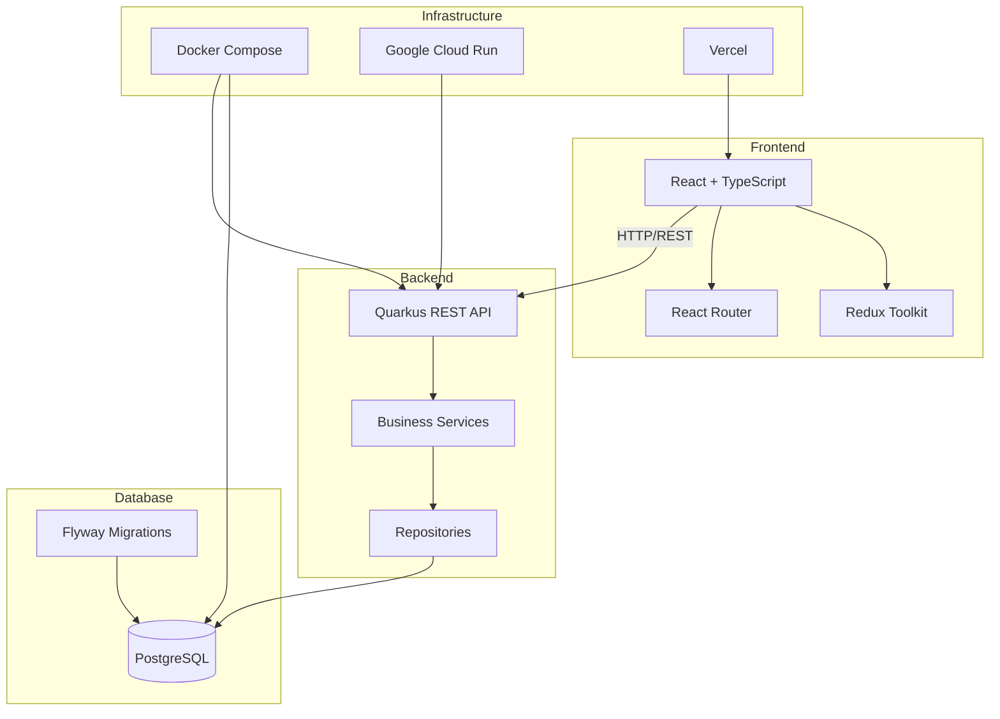
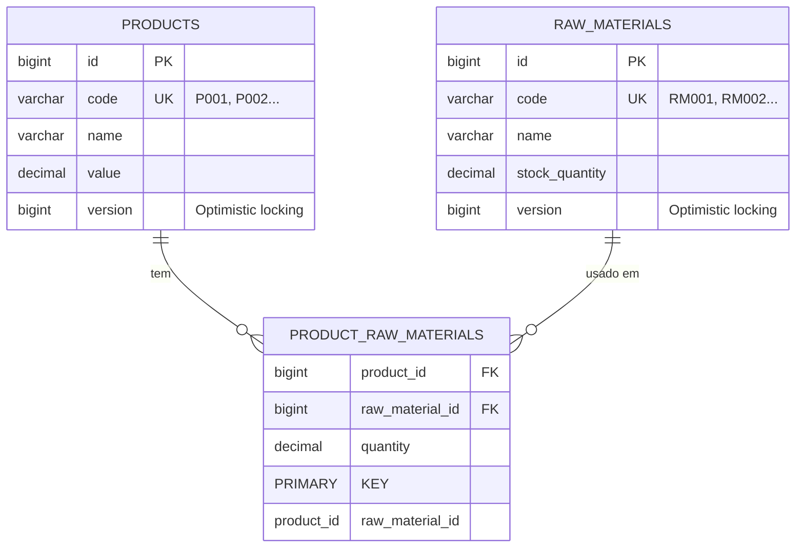

# Autoflex - Sistema de Controle de Estoque e Produção


Sistema completo de gerenciamento de produtos, matérias-primas e sugestões de produção baseado em estoque disponível.

## 📋 Índice

- [Sobre o Projeto](#-sobre-o-projeto)
- [Arquitetura](#️-arquitetura)
- [Tecnologias](#-tecnologias)
- [Pré-requisitos](#-pré-requisitos)
- [Instalação e Execução](#️-instalação-e-execução)
- [Desenvolvimento](#-desenvolvimento)
- [API e Endpoints](#-api-e-endpoints)
- [Banco de Dados](#️-banco-de-dados)
- [Testes](#-testes)
- [Deploy](#-deploy)
- [Segurança](#-segurança)
- [Monitoramento e Métricas](#-monitoramento-e-métricas)
- [Troubleshooting](#-troubleshooting)
- [Contribuindo](#-contribuindo)

## 📋 Sobre o Projeto

O **Autoflex** é uma aplicação full-stack desenvolvida para gerenciar produtos, matérias-primas e calcular sugestões de produção otimizadas baseadas no estoque disponível. O sistema prioriza a produção de produtos com maior valor unitário, considerando as matérias-primas necessárias e o estoque atual.

### Funcionalidades Principais

- **Gerenciamento de Produtos**: CRUD completo de produtos com código, nome e valor unitário
- **Gerenciamento de Matérias-Primas**: Controle de estoque com quantidade disponível
- **Associação Produto-Matéria-Prima**: Definir quais matérias-primas são necessárias para cada produto
- **Sugestões de Produção**: Algoritmo inteligente que calcula quantos produtos podem ser produzidos, priorizando produtos com maior valor unitário
- **Confirmação de Produção**: Atualização automática de estoque com controle de concorrência e transações atômicas
- **Autenticação JWT**: Sistema de autenticação seguro com tokens de acesso e refresh
- **Internacionalização**: Suporte a múltiplos idiomas (Português e Inglês)

## 🏗️ Arquitetura

O projeto segue uma arquitetura de microserviços com separação clara entre frontend e backend:



### Estrutura do Projeto

```
autoflex/
├── front-end/              # Aplicação React (Vite + TypeScript)
│   ├── src/
│   │   ├── components/      # Componentes reutilizáveis
│   │   ├── features/        # Features organizadas por domínio
│   │   ├── services/        # Serviços de API
│   │   ├── store/           # Redux store e slices
│   │   ├── types/           # TypeScript types
│   │   ├── hooks/           # Custom hooks
│   │   ├── i18n/            # Internacionalização
│   │   └── utils/           # Utilitários
│   ├── cypress/             # Testes E2E
│   ├── package.json
│   └── vite.config.ts
│
├── backend/                 # API REST (Quarkus + Kotlin)
│   ├── src/
│   │   ├── main/
│   │   │   ├── kotlin/
│   │   │   │   └── com/autoflex/
│   │   │   │       ├── entity/        # Entidades JPA
│   │   │   │       ├── repository/     # Repositórios Panache
│   │   │   │       ├── service/        # Lógica de negócio
│   │   │   │       ├── resource/       # REST Controllers
│   │   │   │       ├── dto/            # Data Transfer Objects
│   │   │   │       ├── exception/      # Exception handlers
│   │   │   │       ├── filter/         # HTTP Filters
│   │   │   │       ├── security/       # Segurança
│   │   │   │       ├── metrics/        # Métricas de negócio
│   │   │   │       └── util/           # Utilitários
│   │   │   └── resources/
│   │   │       ├── db/migration/      # Migrações Flyway
│   │   │       └── application.properties
│   │   └── test/                       # Testes
│   ├── docker-compose.yml
│   ├── Dockerfile
│   ├── Dockerfile.cloudrun
│   ├── deploy-cloudrun.sh
│   └── pom.xml
│
├── README.md
└── QUICK_START_DEPLOY.md
```

## 🚀 Tecnologias

### Frontend

| Tecnologia | Versão | Descrição |
|------------|--------|-----------|
| **React** | 18.3.1 | Biblioteca UI para construção de interfaces |
| **TypeScript** | 5.2.2 | Tipagem estática para JavaScript |
| **Vite** | 5.0.8 | Build tool e dev server ultra-rápido |
| **Material-UI (MUI)** | 5.15.0 | Componentes de interface prontos |
| **Redux Toolkit** | 2.0.1 | Gerenciamento de estado global |
| **React Router** | 6.21.1 | Roteamento client-side |
| **Jest** | 29.7.0 | Framework de testes unitários |
| **Cypress** | 13.6.2 | Testes end-to-end |
| **i18next** | - | Internacionalização |

### Backend

| Tecnologia | Versão | Descrição |
|------------|--------|-----------|
| **Kotlin** | 1.9.22 | Linguagem de programação moderna e concisa |
| **Quarkus** | 3.6.4 | Framework Java/Kotlin reativo e otimizado |
| **Hibernate ORM Panache** | - | ORM simplificado com Kotlin |
| **PostgreSQL** | 15 | Banco de dados relacional |
| **RESTEasy Reactive** | - | Framework REST reativo |
| **Hibernate Validator** | - | Validação de dados |
| **Flyway** | - | Migrações de banco de dados |
| **SmallRye Health** | - | Health checks |
| **SmallRye OpenAPI** | - | Documentação Swagger/OpenAPI |
| **SmallRye JWT** | - | Autenticação JWT |
| **Micrometer** | - | Métricas Prometheus |
| **Maven** | 3.9+ | Gerenciamento de dependências |

### Infraestrutura

- **Docker & Docker Compose** - Containerização e orquestração
- **PostgreSQL 15** - Banco de dados relacional
- **Google Cloud Run** - Plataforma serverless para backend
- **Vercel** - Plataforma de deploy para frontend

## 📦 Pré-requisitos

### Para Desenvolvimento Local

- **Node.js** 18+ e **npm** ou **yarn**
- **Java** 17+ (JDK) - Recomendado: Eclipse Temurin
- **Maven** 3.9+
- **Docker** e **Docker Compose** 2.0+

### Para Produção

- **Docker** e **Docker Compose** (recomendado)
- Ou servidor com Java 17+ e PostgreSQL 15+
- **Google Cloud SDK** (para deploy no Cloud Run)
- **Vercel CLI** (para deploy do frontend)

### Verificar Instalações

```bash
# Verificar Node.js
node --version  # Deve ser >= 18.0.0

# Verificar Java
java -version  # Deve ser >= 17

# Verificar Maven
mvn --version  # Deve ser >= 3.9.0

# Verificar Docker
docker --version
docker compose version
```

## 🛠️ Instalação e Execução

### Opção 1: Docker Compose (Recomendado)

Esta é a forma mais simples de executar todo o sistema localmente:

```bash
# 1. Clonar o repositório (se ainda não tiver)
git clone <repository-url>
cd autoflex

# 2. Iniciar Backend e PostgreSQL
cd backend
docker compose up -d

# Aguardar os serviços iniciarem (pode levar alguns minutos na primeira vez)
# Verificar status:
docker compose ps

# Ver logs do backend:
docker compose logs -f backend

# Ver logs do PostgreSQL:
docker compose logs -f postgres
```

O backend estará disponível em: `http://localhost:8081`

```bash
# 3. Iniciar Frontend (em outro terminal)
cd front-end
npm install
npm run dev
```

O frontend estará disponível em: `http://localhost:5173`

### Opção 2: Desenvolvimento Local

#### Backend:

```bash
cd backend

# 1. Iniciar PostgreSQL via Docker
docker compose up -d postgres

# Aguardar PostgreSQL estar pronto (verificar logs)
docker compose logs -f postgres

# 2. Executar backend localmente com hot reload
mvn quarkus:dev
```

O backend iniciará em modo desenvolvimento com hot reload habilitado.

#### Frontend:

```bash
cd front-end

# 1. Instalar dependências
npm install

# 2. Executar em modo desenvolvimento
npm run dev
```

### Verificar Instalação

Após iniciar os serviços, verifique se tudo está funcionando:

```bash
# Health check do backend
curl http://localhost:8081/health

# Listar produtos (deve retornar array vazio inicialmente)
curl http://localhost:8081/api/products

# Acessar Swagger UI
# http://localhost:8081/swagger-ui?apiKey=projedata
```

## 💻 Desenvolvimento

### Scripts Disponíveis

#### Frontend

```bash
cd front-end

# Desenvolvimento com hot reload
npm run dev

# Build para produção
npm run build

# Preview do build de produção
npm run preview

# Testes unitários
npm test

# Testes em modo watch
npm run test:watch

# Cobertura de testes
npm run test:coverage

# Testes E2E (abrir interface)
npm run cypress:open

# Testes E2E (executar headless)
npm run cypress:run

# Linter
npm run lint
```

#### Backend

```bash
cd backend

# Modo desenvolvimento com hot reload
mvn quarkus:dev

# Build
mvn clean package

# Build sem testes
mvn clean package -DskipTests

# Executar testes
mvn test

# Executar testes específicos
mvn test -Dtest=ProductServiceTest

# Cobertura de código (JaCoCo)
mvn clean test jacoco:report

# Ver relatório de cobertura
# Abrir: target/site/jacoco/index.html
```

### Hot Reload

- **Frontend**: Vite oferece hot module replacement (HMR) automático
- **Backend**: Quarkus Dev Mode recarrega automaticamente ao detectar mudanças

### Estrutura de Código

#### Frontend - Organização por Features

```
src/
├── features/
│   ├── products/           # Feature de produtos
│   │   ├── components/     # Componentes específicos
│   │   └── ...
│   ├── rawMaterials/       # Feature de matérias-primas
│   ├── productRawMaterials/ # Feature de associações
│   └── production/         # Feature de produção
├── components/
│   └── common/             # Componentes compartilhados
├── services/               # Serviços de API
├── store/                  # Redux store
└── types/                  # TypeScript types
```

#### Backend - Arquitetura em Camadas

```
com.autoflex/
├── entity/                 # Entidades JPA (modelo de dados)
├── repository/             # Camada de acesso a dados (Panache)
├── service/                # Lógica de negócio
├── resource/               # REST Controllers (API)
├── dto/                    # Data Transfer Objects
├── exception/              # Exception handlers
├── filter/                 # HTTP Filters (CORS, Auth, Logging)
├── security/               # Configuração de segurança
└── util/                   # Utilitários
```

## 📡 API e Endpoints

Base URL: `http://localhost:8081/api`

### Autenticação

#### Login
```http
POST /api/auth/login
Content-Type: application/json

{
  "username": "admin",
  "password": "admin123"
}
```

**Resposta:**
```json
{
  "accessToken": "eyJhbGciOiJSUzI1NiIsInR5cCI6IkpXVCJ9...",
  "refreshToken": "refresh_token_here",
  "tokenType": "Bearer",
  "expiresIn": 3600
}
```

#### Refresh Token
```http
POST /api/auth/refresh
Content-Type: application/json

{
  "refreshToken": "refresh_token_here"
}
```

### Produtos

#### Listar Todos os Produtos
```http
GET /api/products
```

**Resposta:**
```json
[
  {
    "code": "P001",
    "name": "Produto A",
    "value": 100.50
  }
]
```

#### Buscar Produto por Código
```http
GET /api/products/{code}
```

#### Criar Produto
```http
POST /api/products
Content-Type: application/json

{
  "name": "Produto A",
  "value": 100.50
}
```

**Nota**: O código é gerado automaticamente pelo sistema (P001, P002, etc.)

#### Atualizar Produto
```http
PUT /api/products/{code}
Content-Type: application/json

{
  "name": "Produto A Atualizado",
  "value": 150.00
}
```

#### Deletar Produto
```http
DELETE /api/products/{code}
```

### Matérias-Primas

#### Listar Todas as Matérias-Primas
```http
GET /api/raw-materials
```

#### Buscar Matéria-Prima por Código
```http
GET /api/raw-materials/{code}
```

#### Criar Matéria-Prima
```http
POST /api/raw-materials
Content-Type: application/json

{
  "name": "Matéria-Prima A",
  "stockQuantity": 1000.00
}
```

**Nota**: O código é gerado automaticamente pelo sistema (RM001, RM002, etc.)

#### Atualizar Matéria-Prima
```http
PUT /api/raw-materials/{code}
Content-Type: application/json

{
  "name": "Matéria-Prima A Atualizada",
  "stockQuantity": 1500.00
}
```

#### Deletar Matéria-Prima
```http
DELETE /api/raw-materials/{code}
```

### Associações Produto-Matéria-Prima

#### Listar Associações de um Produto
```http
GET /api/products/{productCode}/raw-materials
```

**Resposta:**
```json
[
  {
    "rawMaterialCode": "RM001",
    "rawMaterialName": "Matéria-Prima A",
    "quantity": 2.5
  }
]
```

#### Criar Associação
```http
POST /api/products/{productCode}/raw-materials
Content-Type: application/json

{
  "rawMaterialCode": "RM001",
  "quantity": 2.5
}
```

#### Atualizar Quantidade
```http
PUT /api/products/{productCode}/raw-materials/{rawMaterialCode}
Content-Type: application/json

{
  "quantity": 3.0
}
```

#### Remover Associação
```http
DELETE /api/products/{productCode}/raw-materials/{rawMaterialCode}
```

### Produção

#### Obter Sugestões de Produção
```http
GET /api/production/suggestions
```

**Resposta:**
```json
{
  "suggestions": [
    {
      "productCode": "P001",
      "productName": "Produto A",
      "suggestedQuantity": 10,
      "totalValue": 1005.00,
      "requiredRawMaterials": [
        {
          "rawMaterialCode": "RM001",
          "rawMaterialName": "Matéria-Prima A",
          "requiredQuantity": 25.0,
          "availableQuantity": 1000.0
        }
      ]
    }
  ],
  "totalValue": 1005.00
}
```

#### Confirmar Produção
```http
POST /api/production/confirm
Content-Type: application/json

{
  "productions": [
    {
      "productCode": "P001",
      "quantity": 10
    }
  ]
}
```

**Resposta:**
```json
{
  "message": "Produção confirmada com sucesso",
  "updatedRawMaterials": [
    {
      "code": "RM001",
      "name": "Matéria-Prima A",
      "previousStock": 1000.0,
      "newStock": 975.0
    }
  ]
}
```

### Documentação Interativa

A documentação completa da API está disponível via Swagger UI:

1. Acesse: `http://localhost:8081/swagger-ui?apiKey=projedata`
2. Ou use o header: `X-API-Key: projedata`

No Swagger UI você pode:
- Visualizar todos os endpoints
- Testar os endpoints diretamente
- Ver exemplos de requisições e respostas
- Entender os modelos de dados
- Ver validações e constraints

## 🗄️ Banco de Dados

### Modelo de Dados



### Schema do Banco de Dados

#### Tabela: `products`

| Coluna | Tipo | Descrição |
|--------|------|-----------|
| `id` | BIGINT | Chave primária (auto-incremento) |
| `code` | VARCHAR(50) | Código único do produto (P001, P002, etc.) |
| `name` | VARCHAR(255) | Nome do produto |
| `value` | DECIMAL(10,2) | Valor unitário do produto |
| `version` | BIGINT | Versão para controle de concorrência (optimistic locking) |

**Índices:**
- `idx_products_code` - Índice único no código
- `idx_products_name` - Índice para busca por nome
- `idx_products_name_value` - Índice composto
- `idx_products_name_fts` - Índice full-text search (GIN)
- `idx_products_version` - Índice para optimistic locking

#### Tabela: `raw_materials`

| Coluna | Tipo | Descrição |
|--------|------|-----------|
| `id` | BIGINT | Chave primária (auto-incremento) |
| `code` | VARCHAR(50) | Código único da matéria-prima (RM001, RM002, etc.) |
| `name` | VARCHAR(255) | Nome da matéria-prima |
| `stock_quantity` | DECIMAL(10,2) | Quantidade em estoque |
| `version` | BIGINT | Versão para controle de concorrência |

**Índices:**
- `idx_raw_materials_code` - Índice único no código
- `idx_raw_materials_name` - Índice para busca por nome
- `idx_raw_materials_name_fts` - Índice full-text search (GIN)
- `idx_raw_materials_version` - Índice para optimistic locking

#### Tabela: `product_raw_materials`

| Coluna | Tipo | Descrição |
|--------|------|-----------|
| `product_id` | BIGINT | FK para `products.id` |
| `raw_material_id` | BIGINT | FK para `raw_materials.id` |
| `quantity` | DECIMAL(10,2) | Quantidade de matéria-prima necessária |

**Chave Primária:** `(product_id, raw_material_id)`

**Índices:**
- `idx_product_raw_materials_product_id` - Para joins com produtos
- `idx_product_raw_materials_raw_material_id` - Para joins com matérias-primas

### Migrações (Flyway)

As migrações do banco de dados são gerenciadas pelo Flyway e estão localizadas em `backend/src/main/resources/db/migration/`:

- `V1__create_sequences.sql` - Cria sequências para geração de códigos thread-safe
- `V2__create_indexes.sql` - Cria índices para otimização de queries

As migrações são executadas automaticamente na inicialização da aplicação.

### Sequências

O sistema usa sequências PostgreSQL para geração thread-safe de códigos:

- `product_code_sequence` - Gera códigos P001, P002, P003, etc.
- `raw_material_code_sequence` - Gera códigos RM001, RM002, RM003, etc.

Isso elimina condições de corrida que ocorreriam com a abordagem `count() + 1`.

### Controle de Concorrência

O sistema implementa controle de concorrência para evitar problemas em ambientes multiusuário:

- **Optimistic Locking**: Usa `@Version` nas entidades `Product` e `RawMaterial`
- **Pessimistic Locking**: Usa locks no banco durante operações críticas (ex: cálculo de sugestões de produção)
- **Transações Atômicas**: Garante que operações de produção sejam atômicas
- **Tratamento de Conflitos**: Retorna erros apropriados quando detecta conflitos de versão

## 🧪 Testes

### Frontend

#### Testes Unitários (Jest + Testing Library)

```bash
cd front-end

# Executar todos os testes
npm test

# Modo watch (re-executa ao detectar mudanças)
npm run test:watch

# Cobertura de código
npm run test:coverage

# Executar testes específicos
npm test -- ProductService.test.ts
```

**Estrutura de Testes:**
- Testes de componentes em `src/components/**/__tests__/`
- Testes de serviços em `src/services/__tests__/`
- Testes de Redux slices em `src/store/slices/__tests__/`

#### Testes E2E (Cypress)

```bash
cd front-end

# Abrir interface do Cypress
npm run cypress:open

# Executar testes em modo headless
npm run cypress:run

# Executar testes específicos
npm run cypress:run -- --spec "cypress/e2e/products.cy.ts"
```

**Testes E2E Disponíveis:**
- `products.cy.ts` - Testes de CRUD de produtos
- `rawMaterials.cy.ts` - Testes de CRUD de matérias-primas
- `productRawMaterials.cy.ts` - Testes de associações
- `production.cy.ts` - Testes de sugestões e confirmação de produção

### Backend

#### Testes Unitários

```bash
cd backend

# Executar todos os testes
mvn test

# Executar testes específicos
mvn test -Dtest=ProductServiceTest

# Executar testes de um pacote
mvn test -Dtest=com.autoflex.service.*Test
```

#### Testes de Integração

```bash
# Testes de recursos REST
mvn test -Dtest=*ResourceTest

# Testes de serviços
mvn test -Dtest=*ServiceTest
```

#### Cobertura de Código (JaCoCo)

```bash
# Gerar relatório de cobertura
mvn clean test jacoco:report

# Verificar cobertura mínima (80%)
mvn clean test jacoco:check

# Ver relatório
# Abrir: target/site/jacoco/index.html
```

O projeto está configurado para exigir **80% de cobertura de código** nas linhas.

**Estrutura de Testes:**
- Testes unitários em `src/test/kotlin/com/autoflex/service/`
- Testes de integração em `src/test/kotlin/com/autoflex/resource/`
- Usa Testcontainers para testes com banco de dados real

## 🚀 Deploy

### Deploy do Backend no Google Cloud Run

O backend está preparado para deploy no Google Cloud Run usando o script automatizado.

#### Pré-requisitos

1. **Google Cloud SDK (gcloud CLI)** instalado
   ```bash
   # Instalar: https://cloud.google.com/sdk/docs/install
   ```

2. **Docker** instalado e rodando

3. **Conta Google Cloud** com projeto criado

4. **Billing habilitado** no projeto GCP

#### Passo a Passo

1. **Autenticar no Google Cloud**:
   ```bash
   gcloud auth login
   gcloud auth configure-docker
   ```

2. **Configurar variáveis de ambiente** (opcional):
   
   Crie um arquivo `.env.cloudrun` na pasta `backend/`:
   ```bash
   DB_USERNAME=autoflex
   DB_PASSWORD=sua_senha_segura
   DB_URL=jdbc:postgresql://seu-postgres-host:5432/autoflex
   AUTOFLEX_API_KEY=sua_chave_api_segura
   ```

3. **Executar o script de deploy**:
   ```bash
   cd backend
   chmod +x deploy-cloudrun.sh
   ./deploy-cloudrun.sh [PROJECT_ID] [REGION] [SERVICE_NAME]
   ```

   **Exemplo**:
   ```bash
   ./deploy-cloudrun.sh meu-projeto-gcp us-central1 autoflex-backend
   ```

   Ou usando variável de ambiente:
   ```bash
   export GOOGLE_CLOUD_PROJECT=meu-projeto-gcp
   ./deploy-cloudrun.sh
   ```

4. **O script irá**:
   - Habilitar APIs necessárias no Google Cloud
   - Fazer build da imagem Docker
   - Enviar imagem para Google Container Registry
   - Fazer deploy no Cloud Run
   - Configurar variáveis de ambiente
   - Testar o health check

5. **Após o deploy**, você receberá a URL do serviço:
   ```
   URL do serviço: https://autoflex-backend-xxxxx.run.app
   Health check: https://autoflex-backend-xxxxx.run.app/health
   Swagger UI: https://autoflex-backend-xxxxx.run.app/swagger-ui
   ```

#### Configurações do Cloud Run

O deploy usa as seguintes configurações padrão:
- **Porta**: 8080
- **Memória**: 1Gi
- **CPU**: 2
- **Instâncias mínimas**: 0 (scale to zero)
- **Instâncias máximas**: 10
- **Timeout**: 300 segundos
- **Acesso**: Público (allow-unauthenticated)

Para alterar, edite o script `deploy-cloudrun.sh`.

#### Verificar Logs

```bash
# Ver logs do serviço
gcloud run services logs read autoflex-backend --region=us-central1

# Seguir logs em tempo real
gcloud run services logs tail autoflex-backend --region=us-central1
```

#### Atualizar Deploy

Para atualizar o serviço após mudanças no código:

```bash
cd backend
./deploy-cloudrun.sh [PROJECT_ID] [REGION] [SERVICE_NAME]
```

O script detecta se o serviço já existe e faz update automaticamente.

### Deploy do Frontend na Vercel

O frontend pode ser facilmente deployado na Vercel.

#### Opção 1: Deploy via Vercel CLI (Recomendado)

1. **Instalar Vercel CLI**:
   ```bash
   npm install -g vercel
   ```

2. **Autenticar na Vercel**:
   ```bash
   vercel login
   ```

3. **Configurar variáveis de ambiente**:
   
   Crie um arquivo `.env.production` na pasta `front-end/`:
   ```bash
   VITE_API_URL=https://seu-backend-url.run.app/api
   ```

4. **Fazer deploy**:
   ```bash
   cd front-end
   vercel --prod
   ```

5. **Seguir as instruções**:
   - Escolher o projeto (ou criar novo)
   - Confirmar configurações
   - Aguardar o build e deploy

#### Opção 2: Deploy via GitHub (Integração Contínua)

1. **Conectar repositório GitHub à Vercel**:
   - Acesse [vercel.com](https://vercel.com)
   - Faça login com sua conta GitHub
   - Clique em "Add New Project"
   - Selecione o repositório do projeto

2. **Configurar o projeto**:
   - **Framework Preset**: Vite
   - **Root Directory**: `front-end`
   - **Build Command**: `npm run build`
   - **Output Directory**: `dist`
   - **Install Command**: `npm install`

3. **Configurar variáveis de ambiente**:
   - Na seção "Environment Variables", adicione:
     - `VITE_API_URL`: URL do seu backend (ex: `https://autoflex-backend-xxxxx.run.app/api`)

4. **Deploy automático**:
   - A cada push na branch `main` (ou `master`), a Vercel fará deploy automaticamente
   - Pull requests geram preview deployments

#### Configuração de CORS no Backend

Após fazer deploy do frontend, você precisa atualizar as origens permitidas no backend:

**Via variável de ambiente no Cloud Run**:
```bash
gcloud run services update autoflex-backend \
  --update-env-vars="QUARKUS_HTTP_CORS_ORIGINS=https://seu-projeto.vercel.app" \
  --region=us-central1
```

Ou adicione múltiplas origens separadas por vírgula:
```bash
gcloud run services update autoflex-backend \
  --update-env-vars="QUARKUS_HTTP_CORS_ORIGINS=https://seu-projeto.vercel.app,https://seu-projeto-git-main-propostas-projects.vercel.app" \
  --region=us-central1
```

### Deploy Completo (Backend + Frontend)

Para fazer deploy completo do sistema:

1. **Deploy do Backend** (Google Cloud Run):
   ```bash
   cd backend
   ./deploy-cloudrun.sh [PROJECT_ID] [REGION] [SERVICE_NAME]
   ```

2. **Anotar URL do Backend**:
   ```
   Backend URL: https://autoflex-backend-xxxxx.run.app
   ```

3. **Configurar Frontend**:
   ```bash
   cd front-end
   # Criar .env.production
   echo "VITE_API_URL=https://autoflex-backend-xxxxx.run.app/api" > .env.production
   ```

4. **Deploy do Frontend** (Vercel):
   ```bash
   vercel --prod
   ```

5. **Atualizar CORS no Backend**:
   ```bash
   gcloud run services update autoflex-backend \
     --update-env-vars="QUARKUS_HTTP_CORS_ORIGINS=https://seu-projeto.vercel.app" \
     --region=us-central1
   ```

6. **Testar**:
   - Acesse a URL do frontend na Vercel
   - Verifique se consegue fazer requisições ao backend
   - Teste as funcionalidades principais

Para mais detalhes, consulte [QUICK_START_DEPLOY.md](QUICK_START_DEPLOY.md).

## 🔐 Segurança

### Autenticação JWT

O sistema implementa autenticação JWT com os seguintes recursos:

- **Access Tokens**: Tokens de curta duração (1 hora) para requisições autenticadas
- **Refresh Tokens**: Tokens de longa duração (24 horas) para renovar access tokens
- **RS256**: Assinatura assimétrica usando chaves RSA
- **Rotação de Tokens**: Suporte a refresh tokens

#### Configuração de Chaves JWT

As chaves JWT são geradas automaticamente ou podem ser configuradas manualmente:

```bash
# Gerar chaves JWT
cd backend
./scripts/generate-jwt-keys.sh
```

Isso gera:
- `src/main/resources/privateKey.pem` - Chave privada para assinar tokens
- `src/main/resources/publicKey.pem` - Chave pública para verificar tokens

### Proteção de Rotas Administrativas

As seguintes rotas estão protegidas e requerem API Key:

- `/swagger-ui` - Interface Swagger
- `/health` - Health check
- `/q/health` - Health check SmallRye
- `/q/openapi.json` - OpenAPI JSON (bloqueado para acesso direto)

**API Key padrão**: `projedata` (configure via `AUTOFLEX_API_KEY` em produção)

**Métodos de autenticação**:
- Header HTTP: `X-API-Key: projedata`
- Query parameter: `?apiKey=projedata`

**Exemplo**:
```bash
# Acessar Swagger UI
curl -H "X-API-Key: projedata" http://localhost:8081/swagger-ui

# Ou via browser
http://localhost:8081/swagger-ui?apiKey=projedata
```

### CORS (Cross-Origin Resource Sharing)

O sistema está configurado para permitir requisições de origens específicas:

**Desenvolvimento:**
- `http://localhost:5173` (Vite dev server)
- `http://localhost:3000` (alternativa)

**Produção:**
- Configurado via variável de ambiente `QUARKUS_HTTP_CORS_ORIGINS`
- Suporta múltiplas origens separadas por vírgula
- Suporta wildcards para preview deployments da Vercel

### Validação de Dados

- **Hibernate Validator**: Validação automática de DTOs e entidades
- **Constraints**: Validações de negócio (ex: valores positivos, campos obrigatórios)
- **Mensagens de Erro**: Mensagens claras e descritivas

### Boas Práticas de Segurança

- ✅ Senhas nunca são expostas em logs
- ✅ Tokens JWT têm expiração configurada
- ✅ API Keys são configuráveis via variáveis de ambiente
- ✅ CORS restrito a origens específicas
- ✅ Validação de entrada em todos os endpoints
- ✅ Controle de concorrência para evitar race conditions
- ✅ Transações atômicas para garantir integridade

## 📊 Monitoramento e Métricas

### Health Checks

O sistema expõe endpoints de health check:

```bash
# Health check geral
curl http://localhost:8081/health

# Liveness probe (verifica se a aplicação está viva)
curl http://localhost:8081/health/live

# Readiness probe (verifica se a aplicação está pronta)
curl http://localhost:8081/health/ready
```

**Resposta:**
```json
{
  "status": "UP",
  "checks": [
    {
      "name": "Database connection health check",
      "status": "UP"
    }
  ]
}
```

### Métricas Prometheus

O sistema expõe métricas no formato Prometheus:

```bash
# Acessar métricas
curl http://localhost:8081/metrics
```

**Métricas Disponíveis:**
- Métricas padrão do Micrometer (JVM, HTTP, etc.)
- Métricas customizadas de negócio (via `BusinessMetrics`)

### Logging

**Desenvolvimento:**
- Formato de texto legível
- Nível DEBUG para pacote `com.autoflex`

**Produção:**
- Formato JSON estruturado
- Nível INFO para logs do framework
- Nível DEBUG para logs da aplicação

**Configuração:**
```properties
# Desenvolvimento
quarkus.log.console.json=false
quarkus.log.category."com.autoflex".level=DEBUG

# Produção
quarkus.log.console.json=true
quarkus.log.category."com.autoflex".level=DEBUG
```

## 🐛 Troubleshooting

### Backend não inicia

**Problema**: O backend não inicia ou falha ao conectar ao banco.

**Soluções**:
```bash
# 1. Verificar se o PostgreSQL está rodando
docker compose ps

# 2. Verificar logs do PostgreSQL
docker compose logs postgres

# 3. Verificar logs do backend
docker compose logs backend

# 4. Verificar se a porta 8081 está livre
lsof -i :8081  # Linux/Mac
netstat -ano | findstr :8081  # Windows

# 5. Verificar conexão com o banco
docker compose exec postgres psql -U autoflex -d autoflex -c "SELECT 1;"
```

### Frontend não conecta ao backend

**Problema**: O frontend não consegue fazer requisições ao backend.

**Soluções**:
1. Verificar se o backend está rodando: `curl http://localhost:8081/health`
2. Verificar a URL da API em `.env`:
   ```bash
   # front-end/.env
   VITE_API_URL=http://localhost:8081/api
   ```
3. Verificar CORS no backend (deve incluir `http://localhost:5173`)
4. Verificar console do navegador para erros
5. Verificar Network tab no DevTools

### Erro de conexão com PostgreSQL

**Problema**: Erro ao conectar ao banco de dados.

**Soluções**:
```bash
# 1. Aguardar PostgreSQL inicializar completamente (pode levar alguns minutos)
docker compose logs -f postgres

# 2. Verificar se o PostgreSQL está saudável
docker compose exec postgres pg_isready -U autoflex

# 3. Testar conexão manual
docker compose exec postgres psql -U autoflex -d autoflex

# 4. Verificar variáveis de ambiente
docker compose exec backend env | grep DB_

# 5. Reiniciar serviços
docker compose restart
```

### Porta já em uso

**Problema**: Erro ao iniciar porque a porta está ocupada.

**Soluções**:
```bash
# Backend (porta 8081)
# Opção 1: Alterar porta no application.properties
quarkus.http.port=8082

# Opção 2: Parar processo que está usando a porta
# Linux/Mac
lsof -ti:8081 | xargs kill -9

# Windows
netstat -ano | findstr :8081
taskkill /PID <PID> /F

# Frontend (porta 5173)
# Alterar no vite.config.ts ou usar flag
npm run dev -- --port 5174
```

### Erro de migração Flyway

**Problema**: Erro ao executar migrações do banco de dados.

**Soluções**:
```bash
# 1. Verificar logs do Flyway
docker compose logs backend | grep -i flyway

# 2. Verificar estado das migrações no banco
docker compose exec postgres psql -U autoflex -d autoflex -c "SELECT * FROM flyway_schema_history;"

# 3. Reparar migrações (se necessário)
# Conectar ao banco e verificar tabelas
docker compose exec postgres psql -U autoflex -d autoflex
```

### Erro de autenticação JWT

**Problema**: Erro ao fazer login ou validar tokens.

**Soluções**:
1. Verificar se as chaves JWT existem:
   ```bash
   ls -la backend/src/main/resources/*.pem
   ```
2. Regenerar chaves se necessário:
   ```bash
   cd backend
   ./scripts/generate-jwt-keys.sh
   ```
3. Verificar configuração no `application.properties`

### Performance lenta

**Problema**: Aplicação está lenta ou demora para responder.

**Soluções**:
1. Verificar uso de recursos:
   ```bash
   docker stats
   ```
2. Verificar logs para queries lentas:
   ```bash
   docker compose logs backend | grep -i "slow"
   ```
3. Verificar índices no banco:
   ```sql
   \d+ products
   \d+ raw_materials
   ```
4. Aumentar recursos no Cloud Run (memória, CPU)

### Problemas comuns no Cloud Run

**Problema**: Timeout no startup.

**Soluções**:
- Aumentar memória e CPU no deploy
- Verificar logs para identificar gargalos
- Otimizar migrações Flyway

**Problema**: Erro 403 ao acessar serviço.

**Soluções**:
```bash
# Garantir que o serviço está público
gcloud run services add-iam-policy-binding autoflex-backend \
  --member="allUsers" \
  --role="roles/run.invoker" \
  --region=us-central1
```

## 👥 Contribuindo

Contribuições são bem-vindas! Siga os passos abaixo:

### 1. Fork do Projeto

Faça um fork do repositório no GitHub.

### 2. Criar Branch

```bash
git checkout -b feature/AmazingFeature
# ou
git checkout -b fix/BugFix
```

### 3. Desenvolvimento

- Siga os padrões de código existentes
- Escreva testes para novas funcionalidades
- Mantenha a cobertura de código acima de 80%
- Atualize a documentação quando necessário

### 4. Commit

```bash
git commit -m "feat: Add amazing feature"
# ou
git commit -m "fix: Fix bug in production service"
```

**Convenção de Commits:**
- `feat:` - Nova funcionalidade
- `fix:` - Correção de bug
- `docs:` - Documentação
- `style:` - Formatação
- `refactor:` - Refatoração
- `test:` - Testes
- `chore:` - Tarefas de manutenção

### 5. Push e Pull Request

```bash
git push origin feature/AmazingFeature
```

Depois, abra um Pull Request no GitHub.

### Code Style

- **Kotlin**: Siga as [Kotlin Coding Conventions](https://kotlinlang.org/docs/coding-conventions.html)
- **TypeScript**: Siga as convenções do ESLint configurado
- **Formatação**: Use os formatadores configurados (Kotlin formatter, Prettier)

### Checklist para Pull Requests

- [ ] Código segue os padrões do projeto
- [ ] Testes foram adicionados/atualizados
- [ ] Todos os testes passam
- [ ] Cobertura de código mantida acima de 80%
- [ ] Documentação atualizada (se necessário)
- [ ] Commits seguem a convenção
- [ ] Sem conflitos com a branch principal

## 📝 Licença

Este projeto foi desenvolvido como teste prático para Autoflex.

## 📞 Suporte

Para questões ou problemas:
- Abra uma [issue](../../issues) no repositório
- Consulte a documentação da API no Swagger UI
- Verifique a seção de [Troubleshooting](#-troubleshooting)

---

**Desenvolvido com ❤️ usando Kotlin, Quarkus, React e TypeScript**
